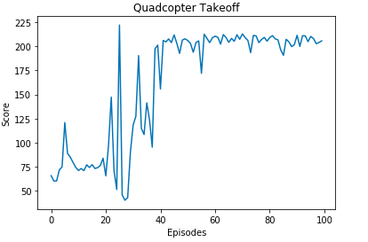

# Deep RL Quadcopter Controller
## Project: Udacity Machine Learning Nanodegree - Reinforcement Learning 
## Overview: 
The goal of this project is to train a quadcopter to fly with a deep reinforcement learning algorithm, specifically it is trained how to take-off. For the algorithm, we use a Deep Deterministic Policy Gradient (DDPG).
#### Final Result :
- Final Reward-Episode Plot  : 

## Contents:
The contents of this repositary are:

* Quadcopter_Project.ipynb: This Jupyter Notebook provides part of the code for training the quadcopter and a summary of the implementation and results.

* task.py: This file defines the task (take-off), and the reward is also defined here.

physics_sim.py: This file introduces a physical simulator for the motion of the quadcopter.

agents/agent.py: This file defines the the DDPG algorithm.
